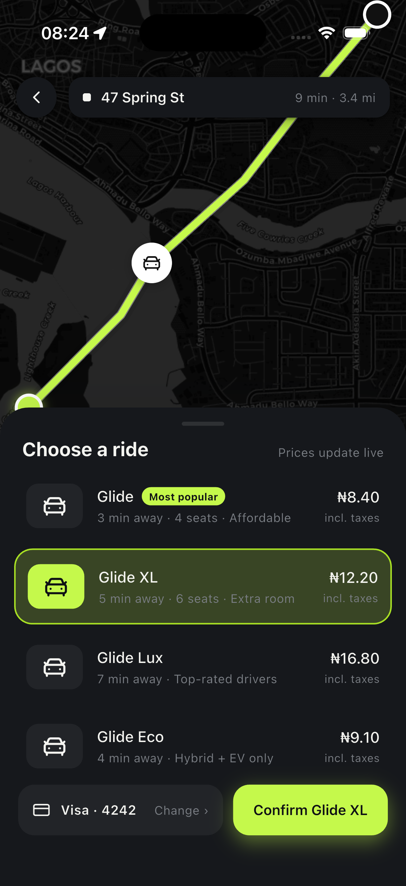
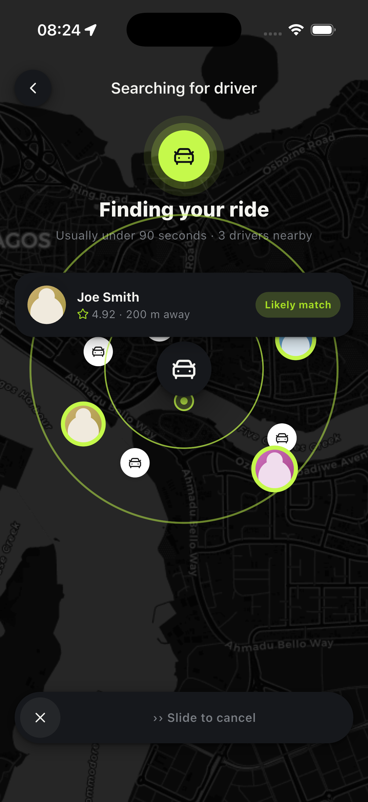
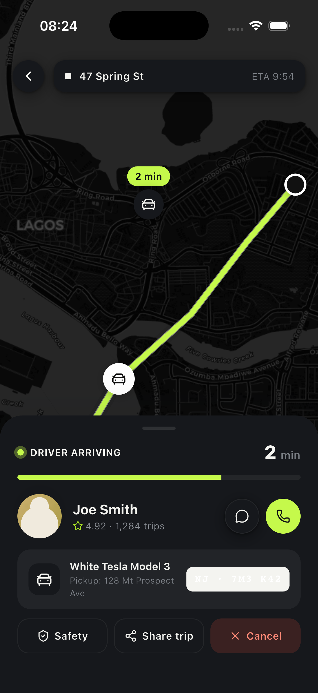
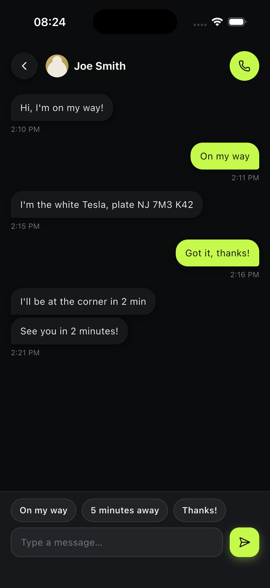
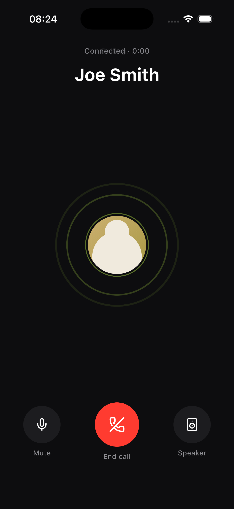
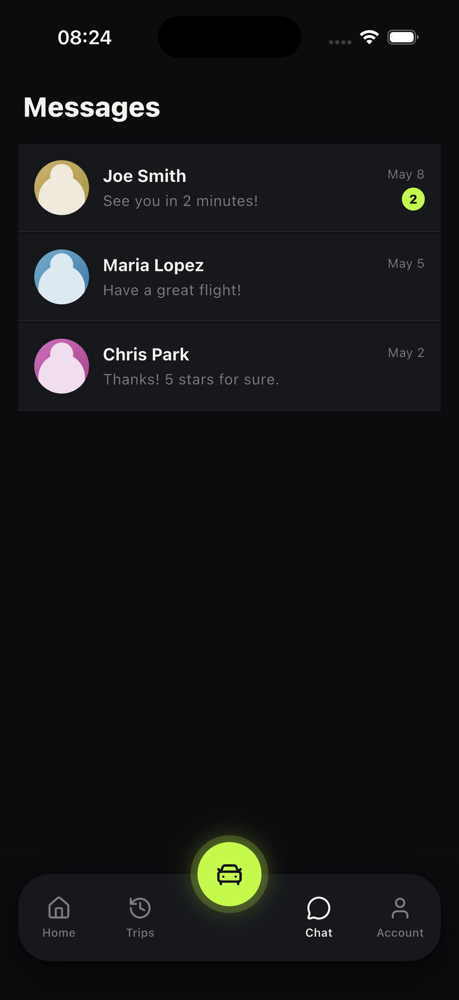
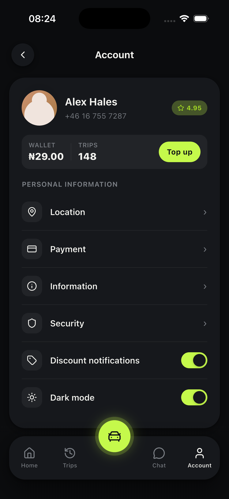
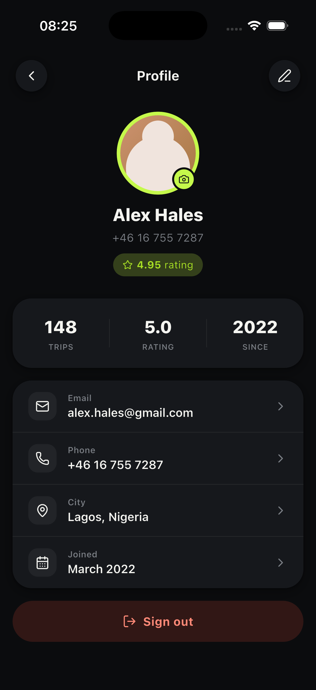

# Glide — Ride-Hailing App

A polished Flutter ride-hailing prototype built for Nigeria, featuring real maps, live location, in-app chat, voice calls, trip history, and a full dark-mode UI.

---

## Screenshots

<table>
  <tr>
    <td align="center"><br/><sub>Choose a Ride</sub></td>
    <td align="center"><br/><sub>Finding Your Ride</sub></td>
    <td align="center"><br/><sub>Driver Arriving</sub></td>
  </tr>
  <tr>
    <td align="center"><br/><sub>In-App Chat</sub></td>
    <td align="center"><br/><sub>Voice Call</sub></td>
    <td align="center"><br/><sub>Messages Inbox</sub></td>
  </tr>
  <tr>
    <td align="center"><br/><sub>Account Settings</sub></td>
    <td align="center"><br/><sub>User Profile</sub></td>
  </tr>
</table>

---

## Features

- **Interactive map** — Real CartoDB tiles (light + dark), GPS-centred on the user's location in Nigeria
- **Full ride flow** — Home → Plan ride → Choose vehicle → Searching → Driver en route → Trip complete
- **Live location detection** — Uses `geolocator` with Nigerian bounding-box validation; falls back to Lagos gracefully
- **In-app messaging** — Chat threads with drivers, quick-reply chips, animated message bubbles
- **Voice call screen** — Animated ripple rings, mute / speaker / end-call controls
- **Trip history** — Expandable past trips with vehicle type badges and ratings
- **User profile** — Avatar, stats (trips / rating / since), editable info rows
- **Account settings** — Dark mode toggle, discount notifications, wallet top-up sheet
- **Search** — Live-filtered location search with saved places and recent history
- **Dark mode by default** — Fully themed with `GlideTokens`; persisted across sessions via `SharedPreferences`

---

## Tech Stack

| Layer | Technology |
|---|---|
| Framework | Flutter 3 / Dart |
| State management | `flutter_bloc` (Cubits) |
| Dependency injection | `get_it` |
| Maps | `flutter_map` + CartoDB tiles |
| Location | `geolocator` |
| Persistence | `shared_preferences` |
| Icons | `lucide_icons_flutter` |
| Functional helpers | `fpdart` |

---

## Architecture

Clean Architecture with a strict four-layer dependency rule:

```
lib/
├── core/               # Shared services (PreferencesService)
├── domain/             # Entities, repository interfaces, use cases
├── data/               # Repository implementations, local data sources
├── presentation/       # Pages, cubits, widgets, theme
└── injection_container.dart   # Composition root (get_it)
```

Dependencies always point inward: `presentation → domain ← data`. No framework code in domain.

---

## Getting Started

**Prerequisites:** Flutter 3.x, Xcode (iOS) or Android Studio (Android)

```bash
# Install dependencies
flutter pub get

# Run on a connected device or simulator
flutter run
```

> **Location on iOS Simulator:** The simulator defaults to San Francisco. Set a Nigerian location via
> **Simulator → Features → Location → Custom Location** → Latitude `6.4220`, Longitude `3.3920`

---

## Project Structure

```
lib/
├── core/services/
│   └── preferences_service.dart
├── domain/
│   ├── entities/          # UserProfile, RideOption, Location, ChatMessage …
│   ├── repositories/      # Abstract contracts
│   └── usecases/          # GetRideOptions, SearchLocations, BookRide …
├── data/
│   ├── datasources/local/ # In-memory mock data sources
│   └── repositories/      # Concrete implementations
└── presentation/
    ├── cubits/            # AppCubit, ChooseRideCubit, WhereToCubit …
    ├── flow/              # GlideFlow (animated screen switcher)
    ├── pages/             # One file per screen
    ├── theme/             # GlideTokens (design tokens, light + dark)
    └── widgets/           # MapBackground, common_widgets, tap_scale …
```

---

## Design Tokens

All colours, shadows, and surface values are driven by `GlideTokens`:

```dart
final t = GlideTokens(dark: true);

t.bg         // Page background
t.card       // Card / surface
t.ink        // Primary text
t.muted      // Secondary text
t.accent     // Brand lime  #C5F94B
t.accentDeep // Deeper lime #A8E024
```

The accent colour (`#C5F94B`) is fixed — it reads clearly on both dark and light surfaces.

---

## License

MIT
